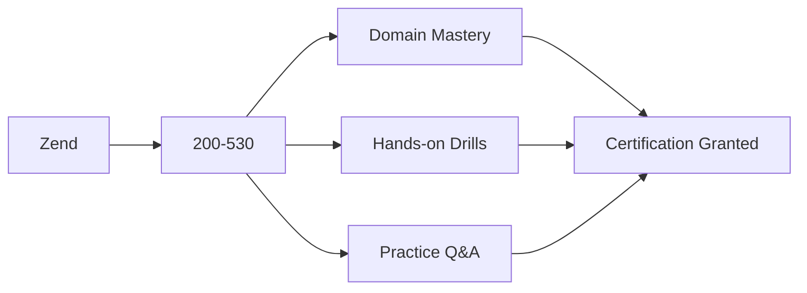

# Zend Certified Engineer - PHP 5.3 (200-530) Certification Reference (`200-530`)

Documentation, domain weighting, and high-quality practice questions for **Zend Certified Engineer - PHP 5.3 (200-530)** from **Zend**.

## Concept Learning Map

## Exam Blueprint & Objectives Table

### Specifications
- **Exam Title**: Zend Certified Engineer - PHP 5.3 (200-530)
- **Exam Code**: `200-530`
- **Vendor**: Zend
- **Exam Duration**: 90 Minutes
- **Number of Questions**: 70
- **Passing Score**: 70%

### Domain Weighting
| Domain / Objective | Weight |
| :--- | :--- |
| PHP 5.3 Syntax, Namespaces & Closures | 25% |
| Object-Oriented PHP & SPL | 30% |
| Web Features, Sessions & Security | 25% |
| Streams, I/O & Database PDO | 20% |

## Technical Demo Practice Questions

Incorporate these 10 technical sample questions into your daily revision routine.

### Question 1
**In PHP development corresponding to 200-530, what is the main benefit of using strict type declarations (`declare(strict_types=1);`)?**

- A. Automatically converts string inputs to integer values at runtime
- B. Prevents implicit type coercion for function arguments and return values
- C. Disables object-oriented features in favor of procedural execution
- D. Speeds up database queries when using PDO

**Correct Answer**: `B. Prevents implicit type coercion for function arguments and return values`

**Explanation**: `declare(strict_types=1);` enforces strict scalar typing, ensuring that argument types and return values match declared types exactly without silent coercion.

---

### Question 2
**Which PDO method should be used to prevent SQL Injection when executing queries with user-supplied parameter inputs?**

- A. `PDO::query()` with concatenated string variables
- B. `PDO::prepare()` combined with bound parameters (`bindValue` / `bindParam`)
- C. `PDO::exec()` with escape quotes
- D. `addslashes()` applied to string input

**Correct Answer**: `B. PDO::prepare() combined with bound parameters (bindValue / bindParam)`

**Explanation**: Prepared statements separate SQL code from user data, ensuring that parameters are safely bound and parameterized to eliminate SQL injection risks.

---

### Question 3
**Regarding Web Features, Sessions & Security in 200-530, which design pattern or language feature ensures low coupling and modular structure?**

- A. Dependency Injection and Interface Segregation
- B. Global variable declaration across all template files
- C. Hardcoding configuration values inside class constructors
- D. Using `eval()` to execute dynamic runtime code

**Correct Answer**: `A. Dependency Injection and Interface Segregation`

**Explanation**: Dependency injection decouples object creation from application logic, promoting testability and clean architecture in modern PHP applications.

---

### Question 4
**In PHP development corresponding to 200-530, what is the main benefit of using strict type declarations (`declare(strict_types=1);`)?**

- A. Automatically converts string inputs to integer values at runtime
- B. Prevents implicit type coercion for function arguments and return values
- C. Disables object-oriented features in favor of procedural execution
- D. Speeds up database queries when using PDO

**Correct Answer**: `B. Prevents implicit type coercion for function arguments and return values`

**Explanation**: `declare(strict_types=1);` enforces strict scalar typing, ensuring that argument types and return values match declared types exactly without silent coercion.

---

### Question 5
**Which PDO method should be used to prevent SQL Injection when executing queries with user-supplied parameter inputs?**

- A. `PDO::query()` with concatenated string variables
- B. `PDO::prepare()` combined with bound parameters (`bindValue` / `bindParam`)
- C. `PDO::exec()` with escape quotes
- D. `addslashes()` applied to string input

**Correct Answer**: `B. PDO::prepare() combined with bound parameters (bindValue / bindParam)`

**Explanation**: Prepared statements separate SQL code from user data, ensuring that parameters are safely bound and parameterized to eliminate SQL injection risks.

---

### Question 6
**Regarding PHP 5.3 Syntax, Namespaces & Closures in 200-530, which design pattern or language feature ensures low coupling and modular structure?**

- A. Dependency Injection and Interface Segregation
- B. Global variable declaration across all template files
- C. Hardcoding configuration values inside class constructors
- D. Using `eval()` to execute dynamic runtime code

**Correct Answer**: `A. Dependency Injection and Interface Segregation`

**Explanation**: Dependency injection decouples object creation from application logic, promoting testability and clean architecture in modern PHP applications.

---

### Question 7
**In PHP development corresponding to 200-530, what is the main benefit of using strict type declarations (`declare(strict_types=1);`)?**

- A. Automatically converts string inputs to integer values at runtime
- B. Prevents implicit type coercion for function arguments and return values
- C. Disables object-oriented features in favor of procedural execution
- D. Speeds up database queries when using PDO

**Correct Answer**: `B. Prevents implicit type coercion for function arguments and return values`

**Explanation**: `declare(strict_types=1);` enforces strict scalar typing, ensuring that argument types and return values match declared types exactly without silent coercion.

---

### Question 8
**Which PDO method should be used to prevent SQL Injection when executing queries with user-supplied parameter inputs?**

- A. `PDO::query()` with concatenated string variables
- B. `PDO::prepare()` combined with bound parameters (`bindValue` / `bindParam`)
- C. `PDO::exec()` with escape quotes
- D. `addslashes()` applied to string input

**Correct Answer**: `B. PDO::prepare() combined with bound parameters (bindValue / bindParam)`

**Explanation**: Prepared statements separate SQL code from user data, ensuring that parameters are safely bound and parameterized to eliminate SQL injection risks.

---

### Question 9
**Regarding Object-Oriented PHP & SPL in 200-530, which design pattern or language feature ensures low coupling and modular structure?**

- A. Dependency Injection and Interface Segregation
- B. Global variable declaration across all template files
- C. Hardcoding configuration values inside class constructors
- D. Using `eval()` to execute dynamic runtime code

**Correct Answer**: `A. Dependency Injection and Interface Segregation`

**Explanation**: Dependency injection decouples object creation from application logic, promoting testability and clean architecture in modern PHP applications.

---

### Question 10
**In PHP development corresponding to 200-530, what is the main benefit of using strict type declarations (`declare(strict_types=1);`)?**

- A. Automatically converts string inputs to integer values at runtime
- B. Prevents implicit type coercion for function arguments and return values
- C. Disables object-oriented features in favor of procedural execution
- D. Speeds up database queries when using PDO

**Correct Answer**: `B. Prevents implicit type coercion for function arguments and return values`

**Explanation**: `declare(strict_types=1);` enforces strict scalar typing, ensuring that argument types and return values match declared types exactly without silent coercion.

---

## Final Review & Practice Materials

Before scheduling your exam, test your knowledge under timed conditions. Check out [200-530 certification dumps](https://www.certsclub.com) for full practice exams and accurate solution sets.
